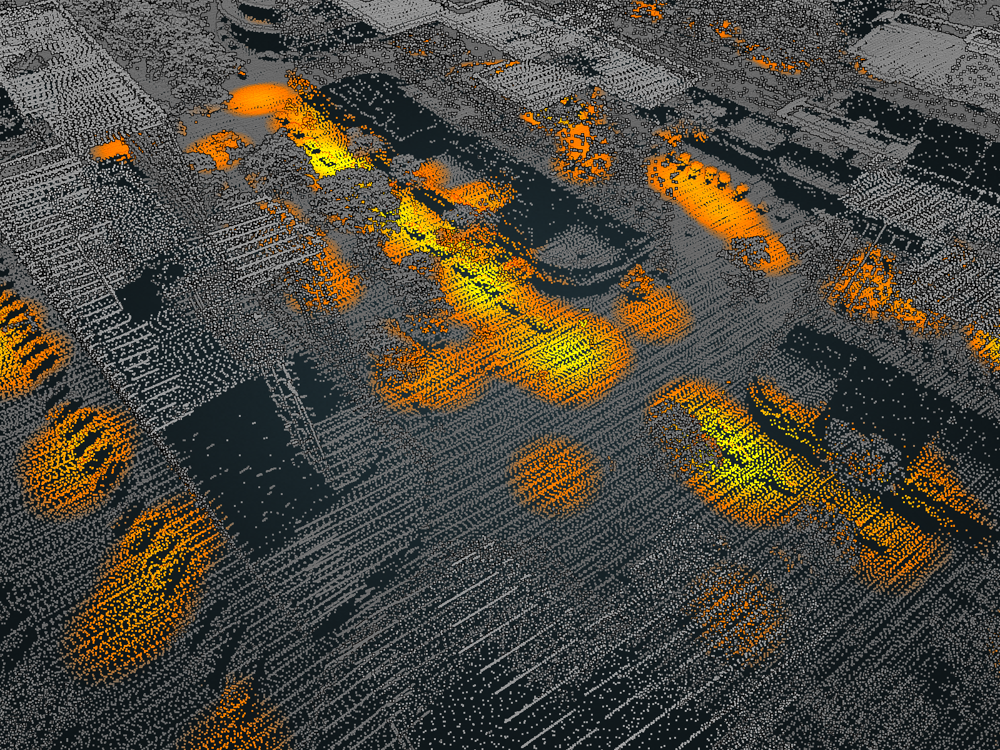

# About

A viewer for 3D visualization of NYU-collected data on egress behavior from NYC COVID-19 exposed health facilities.

# Development

## Preparing

 * Add `data/` folder tracked outside of repo due to size (shared Google Drive)
 * `npm install`

## Running

 * `npm start`
 * Go to `http://localhost:1234/src`

## Modifying

 * Modify `src/index.html` and `src/app.js`

# Credits

* [potree](https://https://github.com/potree/potree) for point cloud rendering

# Authors

 * Chris Carey
 * José Romero
